# Домашнее задание 3

## Навбар 
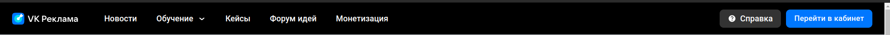

- Навбар. При нажатии на иконку "VK реклама" открывается главная страница https://ads.vk.com/
- Навбар. При нажатии на кнопку новости открывается страница новостей https://ads.vk.com/news
- Навбар. При нажатии на кнопку обучение появляется список с кнопками "Полезные материалы", "Мероприятия", "Видеокурсы" и "Сертификация"
    - Навбар. Список "Обучение". При нажатии на При нажатии на кнопку "Полезные материалы" открывается страница с полезными материалами https://ads.vk.com/insights
    - Навбар. Список "Обучение". При нажатии на кнопку "Мероприятия" открывается страница мероприятий https://ads.vk.com/events
    - Навбар. Список "Обучение". При нажатии на кнопку "Видеокурсы" в новой вкладке открывается страница видеокурсов https://expert.vk.com/catalog/courses/
    - Навбар. Список "Обучение". При нажатии на кнопку "Сертификация" в новой вкладке открывается страница сертификации https://expert.vk.com/certification/
- Навбар. При нажатии на кнопку "Кейсы" открывается страница кейсов https://ads.vk.com/cases
- Навбар. При нажатии на кнопку "Форум идей" открывается страница форума идей https://ads.vk.com/upvote
- Навбар. При нажатии на кнопку "Монетизация" в новой вкладке открывается страница монетизации https://ads.vk.com/partner
- Навбар. При нажатии на кнопку "Справка" открывается страница со справкой https://ads.vk.com/help
- Навбар. При нажатии на кнопку "Перейти в кабинет" открывается страница авторизации 

## Футер
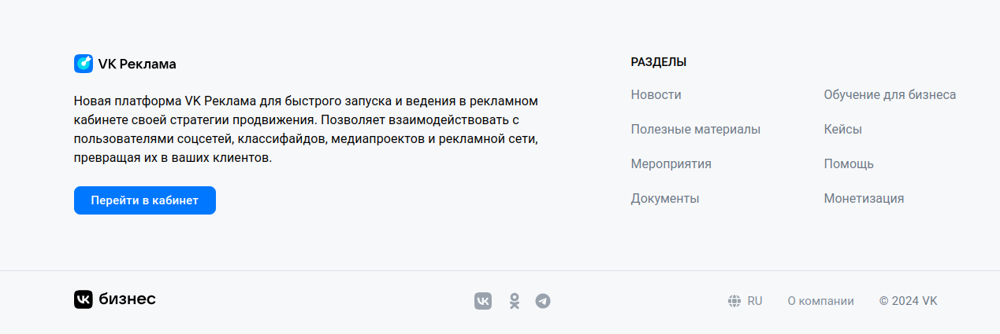

- Футер. При нажатии кнопки "Перейти в кабинет" открывается страница авторизации. 
- Футер. При нажатии кнопки "Новости" открывается страница новостей https://ads.vk.com/news. 
- Футер. При нажатии на кнопку "Обучение для бизнеса" открывается страница обучения для бизнеса https://expert.vk.com/
- Футер. При нажатии на кнопку "Полезные материалы" открывается страница полезных материалов https://ads.vk.com/insights
- Футер. При нажатии на кнопку "Кейсы" открывается страница кейсов https://ads.vk.com/cases
- Футер. При нажатии на кнопку "Мероприятия" открывается страница мероприятий https://ads.vk.com/events
- Футер. При нажатии на кнопку "Помощь" открывается страница помощи https://ads.vk.com/help
- Футер. При нажатии на кнопку "Документы" открывается страница документов https://ads.vk.com/documents
- Футер. При нажатии на кнопку "Монетизация" открывается страница монетизации https://ads.vk.com/partner
- Футер. При нажатии на иконку "VK бизнес" открывается страница https://vk.company/ru/company/business/
- Футер. При нажатии на логотип ВК открывается страница группы в ВК https://vk.com/vk_ads
- Футер. При нажатии на логотип Одноклассников открывается страница группы в ОК https://ok.ru/group/64279825940712
- Футер. При нажатии на логотип Телеграма открывается страница канала в ТГ https://t.me/vk_ads
- Футер. При нажатии на кнопку "О компании" открывается страница, посвященная компании https://vk.company/ru/
- Футер. При нажатии на кнопку RU(или EN) появляется меню с кнопками "English" и "Русский"
  - Футер. Выпадающее меню выбора языка. При нажатии на кнопку "English" страница переводится на английский.
  - Футер. Выпадающее меню выбора языка. При нажатии на кнопку "Русский" страница переводится на русский.
### Футер на странице монетизации
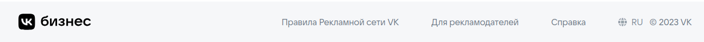
- Футер. Монетизация. При нажатии на иконку "VK бизнес" открывается страница https://vk.company/ru/company/business/
- Футер. Монетизация. При нажатии на кнопку "Правила Рекламной сети VK" открывается страница с правилами https://ads.vk.com/help/articles/partner_rules
- Футер. Монетизация. При нажатии на кнопку "Для рекламодателей" открывается главная страница https://ads.vk.com/
- Футер. Монетизация. При нажатии на кнопку "Справка" открывается страница кабинета партнера https://ads.vk.com/help/categories/partner
- Футер. Монетизация. При нажатии на кнопку "О компании" открывается страница, посвященная компании https://vk.company/ru/
- Футер. Монетизация. При нажатии на кнопку RU(или EN) появляется меню с кнопками "English" и "Русский"
  - Футер. Монетизация. Выпадающее меню выбора языка. При нажатии на кнопку "English" страница переводится на английский.
  - Футер. Монетизация. Выпадающее меню выбора языка. При нажатии на кнопку "Русский" страница переводится на русский.

## Регистрация
https://ads.vk.com/hq/registration

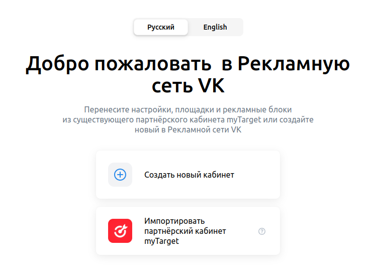
- Регистрация. При нажатии на кнопку "Создать новый кабинет" открывается страница создания нового кабинета https://ads.vk.com/hq/registration/new

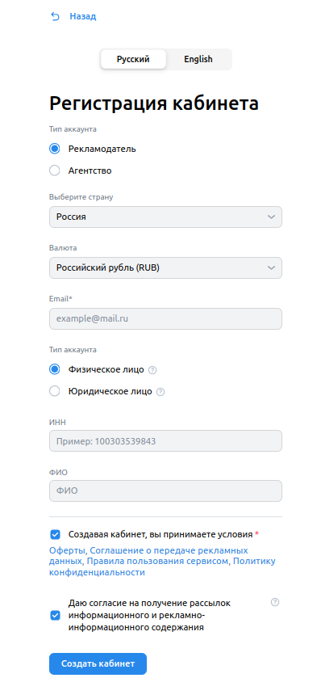
- Регистрация. При нажатии на кнопку "Назад" открывается предыдущая страница со способами создания кабинета https://ads.vk.com/hq/registration
- Регистрация. При нажатии на кнопку "Русский" язык меняется на русский.
- Регистрация. При нажатии на кнопку "English" язык меняется на английский.
- Регистрация. Если выбрана страна "Россия" в поле "Валюта" выставлен "Российский рубль (RUB)", иначе "Доллар США (USD)"
с возможностью сменить на "Евро (EUR)"
- Регистрация. Появляется ошибка "Обязательное поле" при незаполненном email
- Регистрация. Ошибка "Некорректный email адрес" при вводе email, не удовлетворяющего условию email = имя + @ + домен
- Регистрация. Ошибка "Минимальная длина 12" при вводе ИНН короче 12 символов
- Регистрация. Ошибка "Максимальная длина 12 символов" при вводе ИНН длиннее 12 символов
- Регистрация. Ошибка "Обязательное поле" при отсутствии галочки возле "Создавая кабинет, вы принимаете условия"
- Регистрация. Если выбрать типа аккаунта "Агентство" исчезает вариант типа аккаунта "Физическое лицо"
- Регистрация. Если выбрать тип аккаунта "Юридическое лицо" скрывается поле ИНН
- Регистрация кабинета. Если корректно заполнить форму регистрации и нажать на кнопку "Создать кабинет" 
открывается страница https://ads.vk.com/hq/dashboard

## Настройки
### Общие
https://ads.vk.com/hq/settings

- Настройки. Общие. Сообщение "Подтвердите почту: <почта>. Перейдите по ссылке в письме или отправьте письмо ещё раз, если не нашли его",
если почтовый адрес не подтвержден

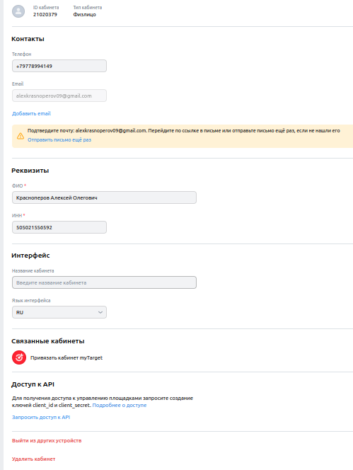

- Настройки. Общие. Если внести изменения в любое из полей, появляются кнопки "Сохранить" и "Отменить"
- Настройки. Общие. Если нажать на кнопку "Отменить" все изменения отменяются
- Настройки. Общие. Если нажать на кнопку "Сохранить" все изменения сохраняются (при условии, что все поля заполнены корректно)
- Настройки. Общие. Ошибка "Некорректный номер телефона", если номер в поле "Телефон" не соответствует виду "+" и 11-13 цифр
- Настройки. Общие. Невозможно ввести более 14 символов в поле "Телефон"
- Настройки. Общие. Если нажать на кнопку "Добавить email" появляется поле для ввода еще одного адреса электронной почты
- Настройки. Общие. Если нажать на кнопку крестик рядом с полем для ввода дополнительного email, поле для ввода исчезает
- Настройки. Общие. Ошибка "Некорректный email адрес" при вводе email, не удовлетворяющего условию email = имя + @ + домен
- Настройки. Общие. Ошибка "Обязательное поле" при пустом поле Email
- Настройки. Общие. Ошибка "Обязательное поле" при пустом поле "ФИО"
- Настройки. Общие. Ошибка "Обязательное поле" при пустом поле "ИНН"
- Настройки. Общие. Ошибка "Минимальная длина 12" при вводе ИНН короче 12 символов
- Настройки. Общие. Невозможно ввести более 12 символов в поле "ИНН"
- Настройки. Общие. Ошибка "Некорректный ИНН" при вводе в поле "ИНН" не цифры
- Настройки. Общие. При нажатии на кнопку в поле "Язык интерфейса" появляется меню с кнопками "RU" и "EN"
  - Настройки. Общие. Поле "Язык интерфейса". При нажатии на кнопку "RU" язык интерфейса меняется на русский
  - Настройки. Общие. Поле "Язык интерфейса". При нажатии на кнопку "EN" язык интерфейса меняется на английский
- Настройки. Общие. При нажатии на кнопку "Выйти из других устройств" появляется сообщение "Активные сеансы на других устройствах успешно завершены."
- Настройки. Общие. При нажатии на кнопку "Удалить кабинет" появляется окно для подтверждения удаления кабинета

### Уведомления
https://ads.vk.com/hq/settings/notifications

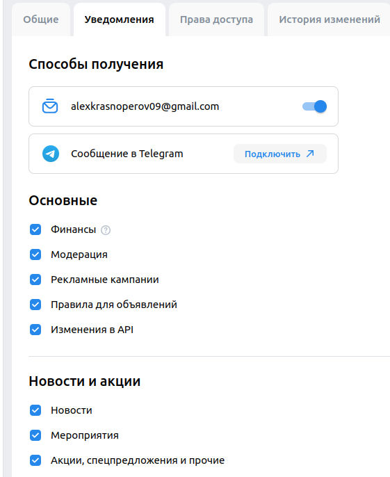

- Настройки. Уведомления. Если внести изменения в любое из полей, появляются кнопки "Сохранить" и "Отменить"
- Настройки. Уведомления. Если нажать на кнопку "Отменить" все изменения отменяются
- Настройки. Уведомления. Если нажать на кнопку "Сохранить" все изменения сохраняются

### Права доступа 
https://ads.vk.com/hq/settings/access

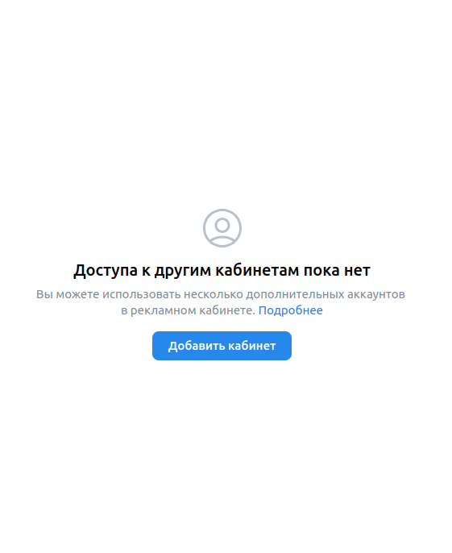

- Настройки. Права доступа. При нажатии на ссылку "Подробнее" открывается страница https://ads.vk.com/help/articles/additionalaccounts
- Настройки. Права доступа. При нажатии на кнопку "Добавить кабинет" открывается форма для добавления кабинета

### История изменений
https://ads.vk.com/hq/settings/logs

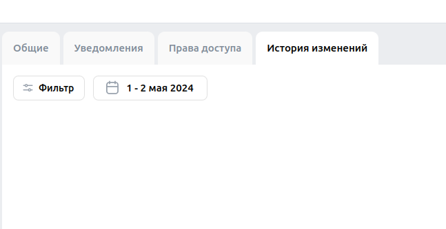

- Настройки. История изменений. При нажатии на кнопку "Фильтр" открывается форма выбора фильтров
  - Настройки. История изменений. Фильтр. При нажатии на кнопку "Тип объекта" открывается форма выбора фильтров по типу объекта
  - Настройки. История изменений. Фильтр. При нажатии на кнопку "Что изменилось" открывается форма выбора фильтров по виду изменений
  - Настройки. История изменений. Фильтр. При нажатии на кнопку "Автор изменений" открывается форма выбора фильтров по автору изменений
- Настройки. История изменений. При нажатии на кнопку с датой открывается форма выбора фильтров по дате 
    - Настройки. История изменений. Дата. При нажатии на кнопку "Сегодня" включается фильтрация по изменениям сегодняшнего дня
    и открывается окно с календарем
    - Настройки. История изменений. Дата. При нажатии на кнопку "Вчера" включается фильтрация по изменениям вчерашнего дня
    и открывается окно с календарем
    - Настройки. История изменений. Дата. При нажатии на кнопку "Эта неделя" включается фильтрация по изменениям этой недели 
    и открывается окно с календарем
    - Настройки. История изменений. Дата. При нажатии на кнопку "Прошлая неделя" включается фильтрация по изменениям прошлой недели 
    и открывается окно с календарем
    - Настройки. История изменений. Дата. При нажатии на кнопку "Этот месяц" включается фильтрация по изменениям этого месяца
      и открывается окно с календарем
    - Настройки. История изменений. Дата. При нажатии на кнопку "Прошлый месяц" включается фильтрация по изменениям прошлого месяца
    и открывается окно с календарем
    - Настройки. История изменений. Дата. При нажатии на кнопку "Последний 31 день" включается фильтрация по изменениям прошлого 31 дня
    и открывается окно с календарем

## Навигация между разделами
https://ads.vk.com/hq/overview

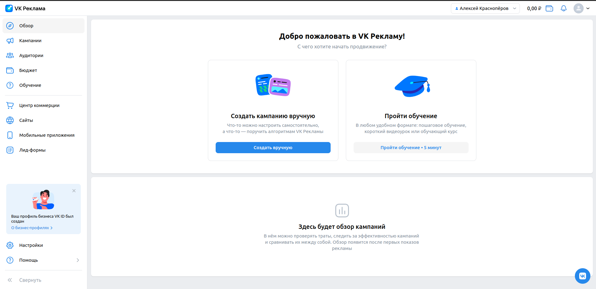

### Сайдбар
- Навигация. Сайдбар. Отображаются кнопки: "Обзор", "Кампании", "Аудитории", "Бюджет", "Обучение", 
"Центр коммерции", "Сайты", "Мобильные приложения", "Лид-формы", "Настройки", "Помощь"
- Навигация. Сайдбар. При нажатии кнопки "Обзор" открывается основная страница https://ads.vk.com/hq/overview
- Навигация. Сайдбар. При нажатии кнопки "Кампании" открывается страница кампаний https://ads.vk.com/hq/dashboard
- Навигация. Сайдбар. При нажатии кнопки "Аудитории" открывается страница аудиторий https://ads.vk.com/hq/audience
- Навигация. Сайдбар. При нажатии кнопки "Бюджет" открывается страница бюджета https://ads.vk.com/hq/budget/transactions
- Навигация. Сайдбар. При нажатии кнопки "Кампании" открывается форма обучения
- Навигация. Сайдбар. При нажатии кнопки "Центр коммерции" открывается страница центра коммерции https://ads.vk.com/hq/ecomm/catalogs
- Навигация. Сайдбар. При нажатии кнопки "Сайты" открывается страница пикселей трекинга https://ads.vk.com/hq/pixels
- Навигация. Сайдбар. При нажатии кнопки "Мобильные приложения" открывается страница с привязанными мобильными приложениями https://ads.vk.com/hq/apps
- Навигация. Сайдбар. При нажатии кнопки "Лид-формы" открывается страница с лид-формами https://ads.vk.com/hq/leadads/leadforms
- Навигация. Сайдбар. При нажатии кнопки "Настройки" открывается страница настроек https://ads.vk.com/hq/settings
- Навигация. Сайдбар. При нажатии кнопки "Помощь" открывается меню с кнопками: "Кейсы компаний", "Справка", "Форум идей", "Задать вопрос"
  - Навигация. Сайдбар. Помощь. При нажатии кнопки "Кейсы компании" открывается страница кейсов https://ads.vk.com/cases
  - Навигация. Сайдбар. Помощь. При нажатии кнопки "Справка" открывается страница со справкой https://ads.vk.com/help
  - Навигация. Сайдбар. Помощь. При нажатии кнопки "Форум идей" открывается страница форума идей https://ads.vk.com/upvote
  - Навигация. Сайдбар. Помощь. При нажатии кнопки "Задать вопрос" открывается окно с чатом
- Навигация. Сайдбар. При нажатии кнопки "Свернуть" сворачивается сайдбар

### Навбар
- Навигация. Навбар. При нажатии на иконку "VK реклама" открывается страница обзора https://ads.vk.com/hq/overview
- Навигация. Навбар. При нажатии на иконку кошелька открывается окно пополнения счета
- Навигация. Навбар. При нажатии на иконку колокольчика появляется окно "Уведомления"
- Навигация. Навбар. При нажатии на аватар пользователя появляется окно с кнопкой "Выйти" и "Управление VK ID"
  - Навигация. Навбар. Кнопка с аватаром пользователя. При нажатии на кнопку "Выйти" открывается главная страница https://ads.vk.com/
  - Навигация. Навбар. Кнопка с аватаром пользователя. При нажатии на кнопку "Управление VK ID" открывается страница управления VK ID

## Бюджет
https://ads.vk.com/hq/budget/transactions

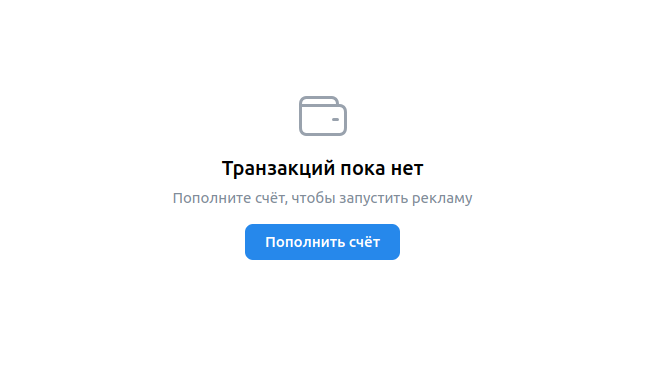
- Бюджет. Если нажать на кнопку "Пополнить счет", открывается окно пополнения счета
- Бюджет. Ошибка "Минимальная сумма 600,00 ₽" при вводе значения меньшего 600 в поле "Сумма к оплате"
- Бюджет. Ошибка "Минимальная сумма 600,00 ₽" при вводе значения меньшего 500 в поле "Сумма, поступающая на ваш счёт (НДС — 20%)"
- Бюджет. При наведении на значок вопроса "?" возле полей "Сумма к оплате" или "Сумма, поступающая на ваш счёт (НДС — 20%)" 
всплывает окно со ссылкой на справку по минимальному платежу и НДС.
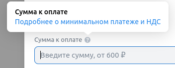
  - Бюджет. Всплывающее окно со справкой. При нажатии на ссылку "Подробнее о минимальном платеже и НДС" открывается 
  страница со справкой по минимальному платежу и НДС https://ads.vk.com/help/articles/billing#min
- Бюджет. Ошибка "уменьшите сумму" при вводе значения больше 200000 в поле "Сумма к оплате"
- Бюджет. Ошибка "уменьшите сумму" при вводе значения больше 166666,67 в поле "Сумма, поступающая на ваш счёт (НДС — 20%)"
- Бюджет. В поле "Сумма к оплате" невозможно ввести символы, помимо цифр и запятой, 
причем если попытаться ввести точку, то введется запятая. 
- Бюджет. В поле "Сумма, поступающая на ваш счёт (НДС — 20%)" невозможно ввести символы, помимо цифр и запятой,
причем если попытаться ввести точку, то введется запятая.
- Бюджет. При вводе значения в поле "Сумма к оплате" автоматически заполняется поле "Сумма, поступающая на ваш счёт (НДС — 20%)". 
("Сумма, поступающая на ваш счёт (НДС — 20%)" = 5/6 * "Сумма к оплате") 
- Бюджет. При вводе значения в поле "Сумма, поступающая на ваш счёт (НДС — 20%)" автоматически заполняется поле "Сумма к оплате".
("Сумма к оплате" = 6/5 * "Сумма, поступающая на ваш счёт (НДС — 20%)") 
- Бюджет. При вводе допустимых значений в поля и нажатии на кнопку "Пополнить счёт" открывается окно оплаты VK Pay
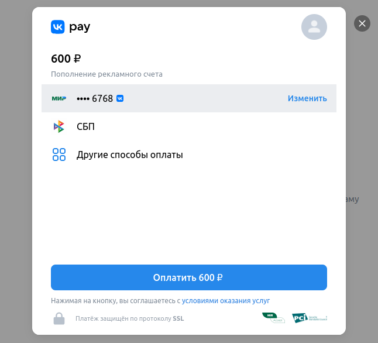